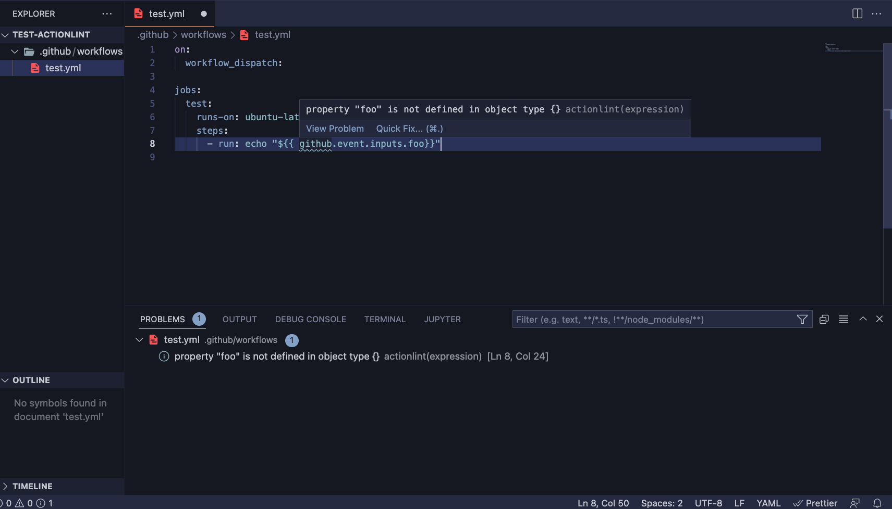

# vscode-actionlint

vscode-actionlint is a GitHub Actions workflow files linter for [Visual Studio Code](https://code.visualstudio.com/) that uses [actionlint](https://github.com/rhysd/actionlint).

## Features

## Requirements

- Install [actionlint](https://github.com/rhysd/actionlint) >=  v1.6.14
- Workflow files must be located under `.github/workflows`
